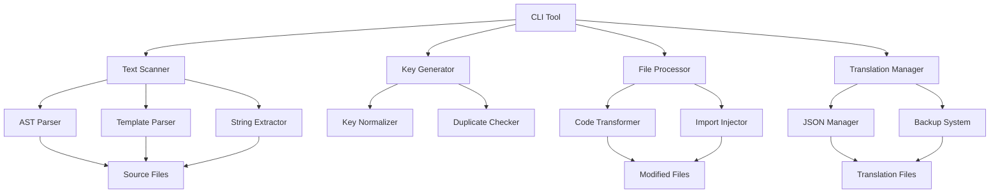

# Design Document

## Overview

The i18n integration system will be implemented as a comprehensive Node.js-based tool that automates the process of internationalizing a Nuxt.js application. The system consists of multiple interconnected components that work together to scan, extract, translate, and integrate Persian/Arabic text strings with the existing @nuxtjs/i18n module.

The design leverages the existing i18n configuration in `nuxt.config.ts` which already supports English and Persian locales with lazy loading and proper RTL/LTR direction handling.

## Architecture

### High-Level Architecture



### Component Architecture

The system is organized into four main layers:

1. **CLI Layer**: Command-line interface for user interaction
2. **Processing Layer**: Core logic for scanning, parsing, and transformation
3. **Management Layer**: Translation file and duplicate management
4. **Integration Layer**: Nuxt.js and Vue.js specific integrations

## Components and Interfaces

### 1. Text Scanner Component

**Purpose**: Identifies and extracts Persian/Arabic text from source files

**Key Classes**:
- `TextScanner`: Main orchestrator
- `ASTParser`: Parses JavaScript/TypeScript files using Babel
- `TemplateParser`: Parses Vue template sections
- `StringExtractor`: Extracts text using Unicode regex patterns

**Interfaces**:
```typescript
interface TextMatch {
  text: string;
  filePath: string;
  lineNumber: number;
  columnNumber: number;
  context: 'template' | 'script' | 'style';
  parentElement?: string;
}

interface ScanResult {
  matches: TextMatch[];
  totalFiles: number;
  processedFiles: number;
  errors: string[];
}
```

### 2. Key Generator Component

**Purpose**: Creates meaningful English keys for Persian/Arabic text

**Key Classes**:
- `KeyGenerator`: Main key generation logic
- `KeyNormalizer`: Normalizes and sanitizes keys
- `DuplicateChecker`: Prevents duplicate keys

**Interfaces**:
```typescript
interface KeyGenerationOptions {
  maxLength: number;
  useContext: boolean;
  prefix?: string;
}

interface GeneratedKey {
  key: string;
  originalText: string;
  confidence: number;
  suggestions?: string[];
}
```

### 3. File Processor Component

**Purpose**: Transforms source files by replacing text with i18n calls

**Key Classes**:
- `FileProcessor`: Main file transformation orchestrator
- `CodeTransformer`: Handles AST transformations
- `ImportInjector`: Adds useI18n imports where needed

**Interfaces**:
```typescript
interface TransformationResult {
  filePath: string;
  originalContent: string;
  transformedContent: string;
  addedImports: string[];
  replacements: TextReplacement[];
}

interface TextReplacement {
  originalText: string;
  replacementKey: string;
  position: { line: number; column: number };
}
```

### 4. Translation Manager Component

**Purpose**: Manages translation files and prevents duplicates

**Key Classes**:
- `TranslationManager`: Main translation file orchestrator
- `JSONManager`: Handles JSON file operations
- `BackupSystem`: Creates backups before modifications

**Interfaces**:
```typescript
interface TranslationEntry {
  key: string;
  value: string;
  locale: string;
  metadata?: {
    addedDate: string;
    sourceFile: string;
    confidence: number;
  };
}

interface DuplicateCheckResult {
  isDuplicate: boolean;
  existingKey?: string;
  similarKeys: string[];
}
```

## Data Models

### Translation Data Model

```typescript
interface TranslationData {
  locales: {
    [locale: string]: {
      [key: string]: string;
    };
  };
  metadata: {
    version: string;
    lastUpdated: string;
    totalKeys: number;
    generatedKeys: number;
  };
}
```

### Configuration Model

```typescript
interface I18nIntegrationConfig {
  sourceDirectories: string[];
  excludePatterns: string[];
  locales: {
    source: string; // 'fa'
    target: string; // 'en'
  };
  keyGeneration: {
    strategy: 'semantic' | 'hash' | 'sequential';
    maxLength: number;
    useContext: boolean;
  };
  fileProcessing: {
    createBackups: boolean;
    dryRun: boolean;
    batchSize: number;
  };
  translationFiles: {
    directory: string;
    format: 'json' | 'yaml';
  };
}
```

### Processing State Model

```typescript
interface ProcessingState {
  phase: 'scanning' | 'generating' | 'transforming' | 'validating';
  progress: {
    current: number;
    total: number;
    percentage: number;
  };
  results: {
    scannedFiles: number;
    foundStrings: number;
    generatedKeys: number;
    transformedFiles: number;
    errors: string[];
  };
}
```

## Error Handling

### Error Categories

1. **File System Errors**: Permission issues, missing files, disk space
2. **Parsing Errors**: Invalid syntax, unsupported file formats
3. **Translation Errors**: Duplicate keys, invalid characters
4. **Integration Errors**: Nuxt config issues, module conflicts

### Error Handling Strategy

```typescript
interface ErrorHandler {
  handleFileSystemError(error: FileSystemError): void;
  handleParsingError(error: ParsingError): void;
  handleTranslationError(error: TranslationError): void;
  handleIntegrationError(error: IntegrationError): void;
}

class ErrorRecovery {
  static recoverFromFileError(error: FileSystemError): boolean;
  static suggestFix(error: ProcessingError): string[];
  static createErrorReport(errors: ProcessingError[]): ErrorReport;
}
```

### Validation System

```typescript
interface ValidationRule {
  name: string;
  validate(data: any): ValidationResult;
  fix?(data: any): any;
}

interface ValidationResult {
  isValid: boolean;
  errors: string[];
  warnings: string[];
  suggestions: string[];
}
```

## Testing Strategy

### Core Testing Approach

- **Integration Validation**: Verify complete workflow with sample files
- **Key Generation Testing**: Ensure unique, meaningful keys are generated
- **File Transformation Testing**: Confirm proper `$t()` function integration
- **Translation File Management**: Validate JSON operations and duplicate detection

## Implementation Phases

### Phase 1: Core Infrastructure
- CLI framework setup
- Configuration management
- Basic file system operations
- Error handling foundation

### Phase 2: Text Processing
- Unicode text detection
- AST parsing for JS/TS files
- Vue template parsing
- Text extraction algorithms

### Phase 3: Key Generation
- Semantic key generation
- Duplicate detection
- Key normalization
- Context-aware naming

### Phase 4: File Transformation
- Code transformation engine
- Import injection
- Template modification
- Backup system

### Phase 5: Translation Management
- JSON file operations
- Duplicate value detection
- Translation validation
- Metadata management

### Phase 6: Integration & Validation
- Nuxt.js integration testing
- End-to-end validation
- Performance optimization
- Documentation and examples

### Phase 7: CLI Bug Fixes and Stability
- Fix missing dependencies in package.json
- Correct file paths for binary and scripts
- Ensure CLI commands display proper output
- Improve error handling and user feedback
- Validate configuration loading and fallback mechanisms